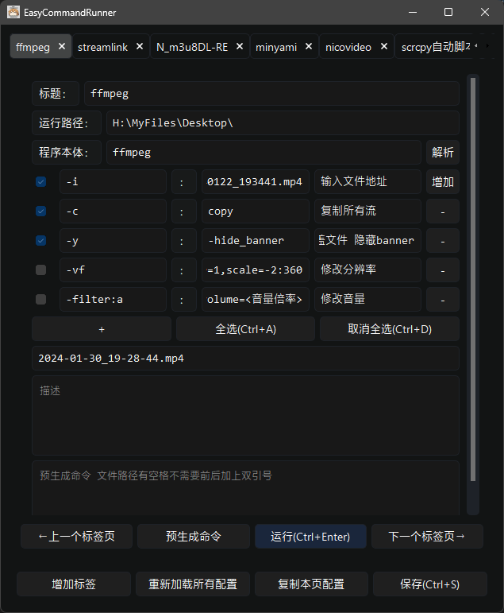
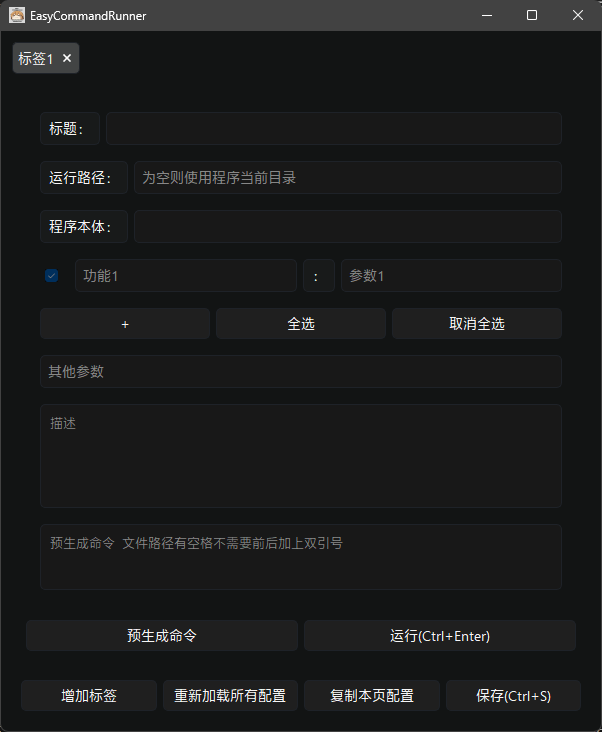
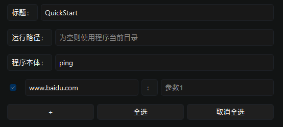
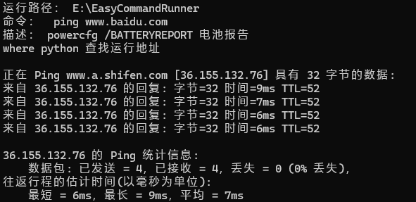
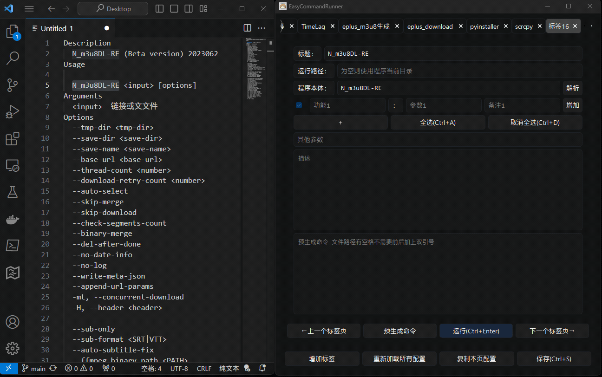
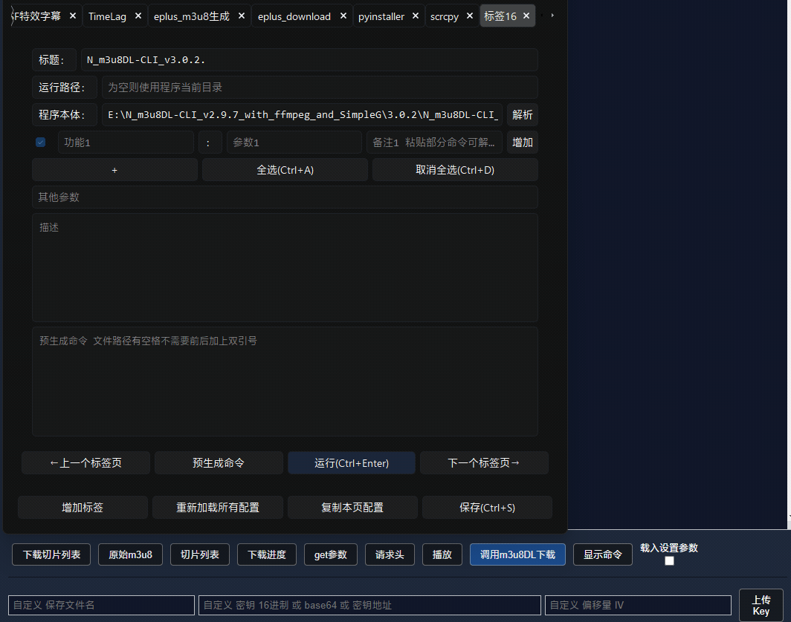
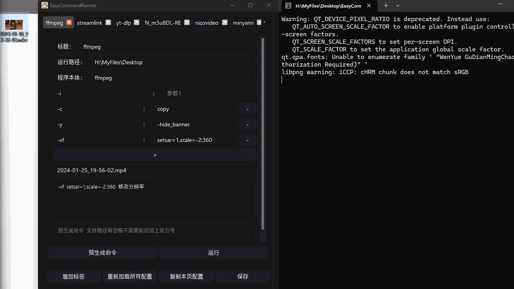
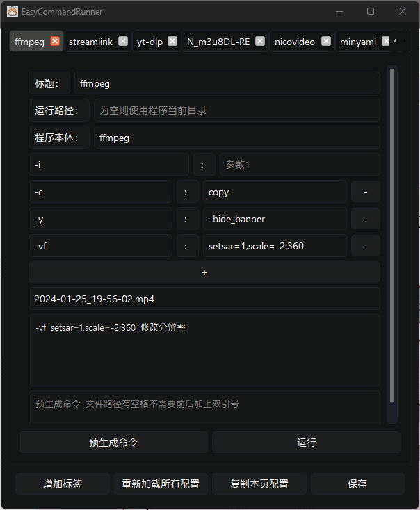
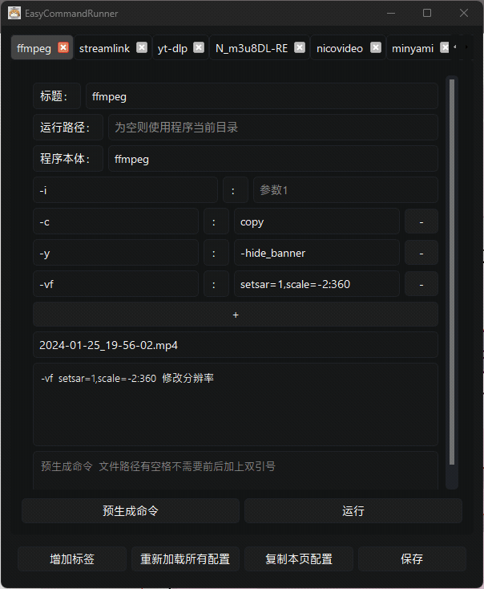

# EasyCommandRunner


# 介绍

EasyCommandRunner是一个简单的保存命令行配置与运行命令行的GUI应用。这个应用的灵感来自`N_m3u8DL-CLI`自带的`N_m3u8DL-CLI-SimpleG`和`QuickCut`。本应用由python编写，通过pyQT5生成GUI界面，理论上支持所有命令行工具。

## 更新历史

### **v0.7更新**
* 新增标签页下拉菜单
* 界面样式小修

### **v0.62更新**
* 实验性功能 - 加入**不包括运行程序的**命令后参数解析功能
* 在`备注1`栏中输入运行程序后的命令，点击`增加`按钮可以解析新命令至旧命令后面

### **v0.61更新**
* 加入上下标签页切换按钮
* 加入上下标签页切换快捷键
* 修改运行按钮样式
* 修复前后空格会导致额外的双引号的bug

### **v0.6更新**
* 加入命令解析功能
* 修复`Ctrl`+`C`在描述栏内无法使用的问题
* 修改描述框和命令预览框的生成逻辑

### **v0.5更新**
* 加入单行命令备注
* 修复`Ctrl`+`S`失效问题

## 用户界面



## 快速开始

### 注意：此演示下的图片为旧版本

以非常常用的网络测试命令`ping www.baidu.com`为例

* 点击`增加标签` 新增空标签页
 


* 在`程序本体`中填入`ping`，在`功能1`中填入`www.baidu.com` ~~这里如果还有其他留空的编辑框是不影响运行的，只取决于你的命令是否正确~~



* 点击`预生成命令` 查看命令内容
  


* 点击`运行` 在另一边的命令行窗口查看运行结果



* 点击`保存` 保存当前配置


## 使用说明
点击保存后会保存所有新增的标签页、各个输入框输入的命令以及描述（备忘）在应用目录下的config.json文件内。运行命令时，描述框内的内容不会被算进命令内，点击加号可以添加新的参数行，新的参数行内容也会被保留（包括空的输入框）。
如果觉得多余，可以通过旁边的减号按钮删除对应行。

### 提示
本工具并非傻瓜式的yt-dlp或者ffmpeg的GUI界面，而是以了解命令行工具自身命令为前提保存常用CLI工具命令的GUI工具，适用于高频率使用命令行工具的人群。在保存一个配置之前，建议先调试好配置是否能够正常运行，善用预生成命令功能。

### 特性
* 由于是多线程，可以多标签页同时运行
* 命令解析 增量命令解析
* 单行命令备注
* 默认关闭窗口时缩小到托盘
*所有输入框都支持拖入文件清除原输入框内容并生成文件路径，但有略微不同，只有描述框是插入文件路径，其余都是文件路径替换所有框内内容。
* 由于使用了`subprocess.list2cmdline`方法，**如果文件路径内有空格不需要前后加上双引号**。
* 当点击保存的时候标签页标题才会更改，如果清空标题，当重新加载配置文件时，标题才会变回默认标题。
* 标签页的标签可以自由拖动。
* 运行路径为空时，默认使用程序所在的路径。
* 每次运行默认打开终端窗口，易于查看和调试。
* 每次运行时自动定位到上一次打开的标签页。
* `Ctrl`+`S`可以快速保存配置。
* `Ctrl`+`Enter`可以快速运行命令
* 第一次保存配置之后，每次运行应用和点击保存时都会比较配置文件变化，如果有变化则会自动备份一次`config.json`。如果改错了配置，可以查看应用目录下的`backup`文件夹，将想要恢复的配置文件重命名为`config.json`复制回应用目录即可。
* 你可以通过自行修改应用目录下的`stylesheet.css`文件来修改窗口样式。
* 如果文件目录下没有`stylesheet.css`文件，则会自动创建空的css文件。
# 演示

### v0.62更新内容演示

在填入命令的时候经常会遇到除去运行程序外只增加一部分后面的命令的情况，可以复制内容后粘贴到`备注1`编辑框下，点击`增加`按钮可以把这部分命令解析后向后添加

**这是实验性功能，在复杂情况下有出bug的可能性**

```可能会有人问为什么增加按钮会在这里，你看，这行数不就对齐了嘛（```

* 演示1：从CLI程序的说明中复制命令解析保存


* 演示2：解析猫抓提供的N_m3u8-DL_CLI命令


### v0.6更新 命令行解析


为了方便美观，如果有两个连续的动作（比如`-动作1 -动作2`或者CMD的`/a /b`，程序会在后面生成一个空格，这种情况下偶尔会生成这种顺序：


善用命令预生成功能，空的编辑框不影响命令运行，命令本身有问题才会影响命令运行。

### 更新了解析逻辑，现在已经不需要在意占位符了

但还是说明一下，建议粘贴命令的时候尽量主程序后面直接跟动作，like:`主程序 -动作1`。如果是`主程序 参数1 -动作...`的情况，为了美观，可以手动改成`主程序 参数 占位字符串 -动作...` 生成后把占位符删掉，以实现美观的解析


### 注意：此演示下的gif为旧版本








# 碎碎念
* 由于本人学艺不精，大部分代码有参考GPT生成的代码，本人负责设计逻辑、调试和debug。~~理由其实很简单因为`N_m3u8_RE`命令和`N_m3u8DL-CLI`不一样还没有GUI，于是自己想了个可以兼容所有CLI工具的GUI。~~
* 开发缘由是平时用到各种各样的CLI工具的频率太高，关键时刻又记不住命令，GUI填起来还是比输入命令方便的，便简单构思了这个GUI应用。
* 在准备保存配置的时候，善用预生成命令功能进行调试。
* 可以同时保存多条甚至不能共用的参数，当不需要的时候点击减号并不保存，然后运行。不过我新增了复选框按钮，可以自由选择需要运行的参数。
* ~~别问为啥关闭标签页的按钮风格那么突兀，因为pyQT5貌似改不了。~~ 把标签页关闭按钮改成了更现代的样式
* 别问我这程序打包起来为什么这么大，pyQT5的框架太大了没办法，本体还是很小巧的。
* 可能有人要问为什么用pyQT5，因为我只会一点python。
* 困困小彼方很可爱。
