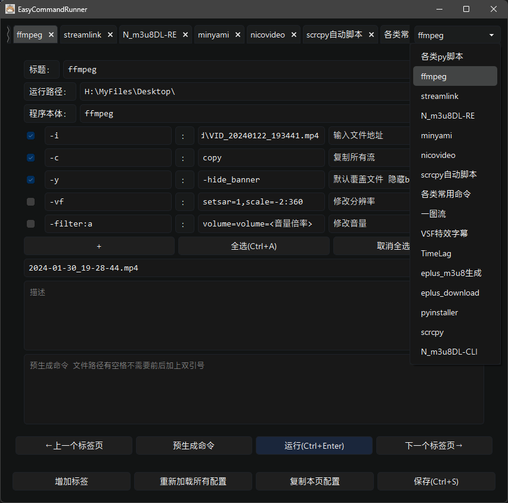
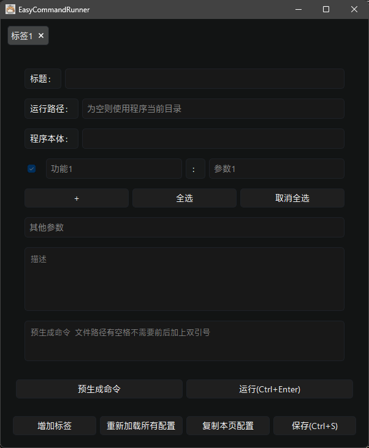
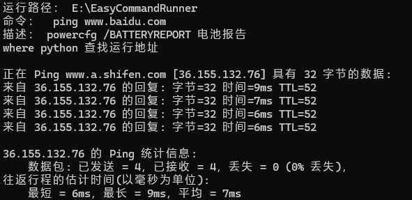
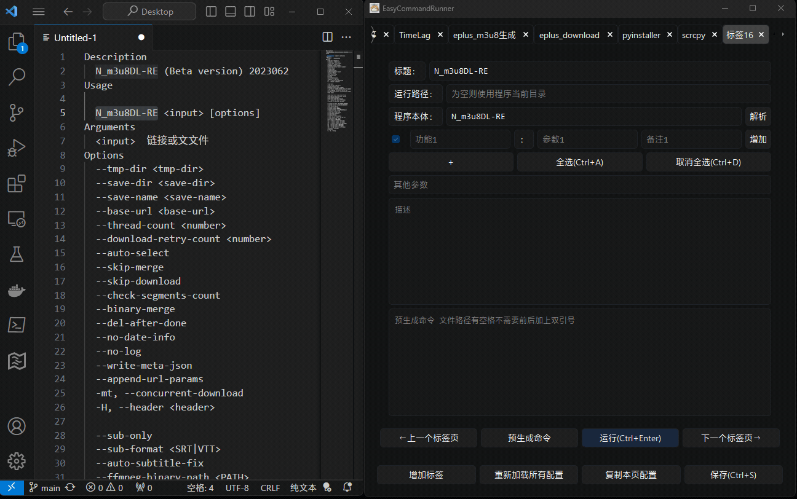
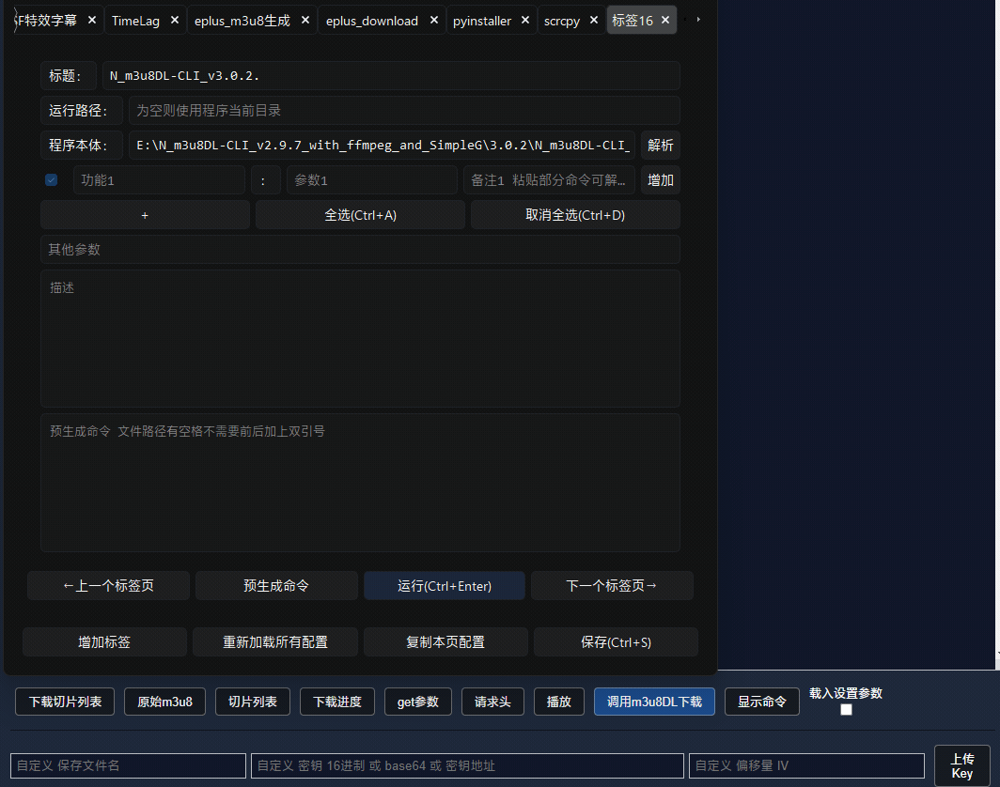
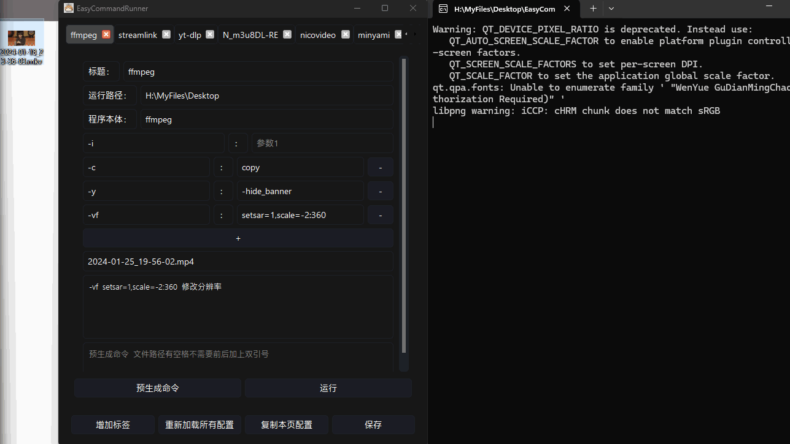
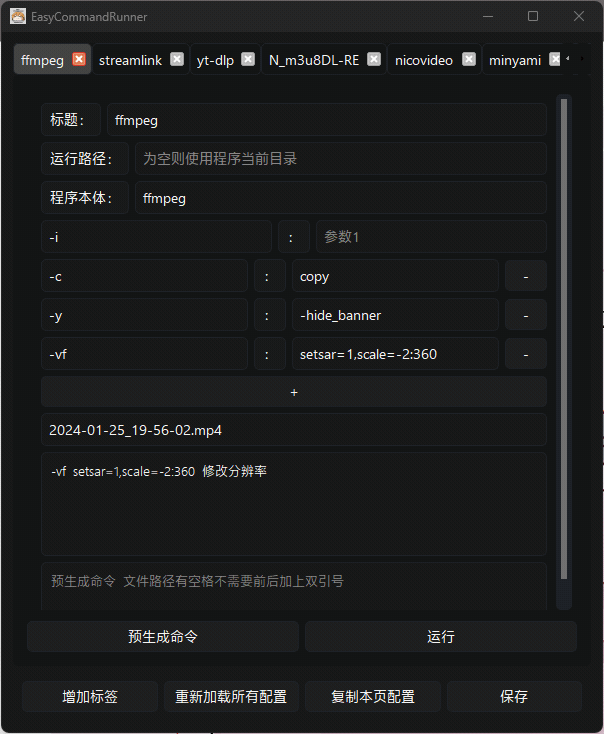
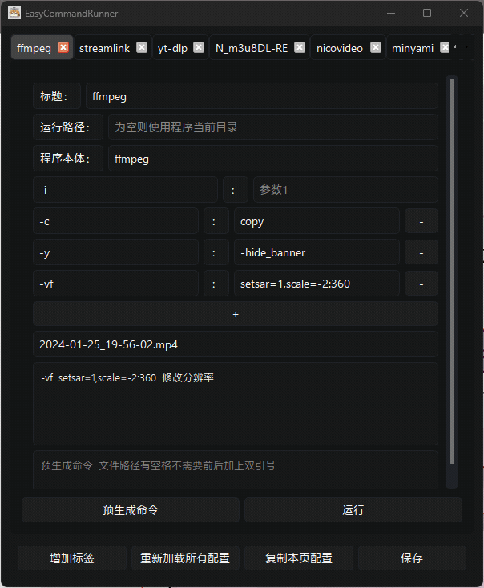

# EasyCommandRunner


# 介绍

EasyCommandRunner 是一个用于保存、编辑和运行命令行配置的 GUI 应用，理论上支持所有命令行工具。

当前发布版 `v0.9.0` 使用 **Rust + Qt6** 重构，支持 Windows、Linux 和 macOS。原 PyQt5 版本保留在 [`legacy`](https://github.com/AlanWanco/EasyCommandRunner/tree/legacy) 分支。

## 下载

最新版本：[v0.9.0 Release](https://github.com/AlanWanco/EasyCommandRunner/releases/tag/v0.9.0)

| 平台 | 文件 |
| --- | --- |
| Windows x86_64 | [Portable ZIP](https://github.com/AlanWanco/EasyCommandRunner/releases/download/v0.9.0/EasyCommandRunner-windows-x86_64.zip) |
| Windows ARM64 | [Portable ZIP](https://github.com/AlanWanco/EasyCommandRunner/releases/download/v0.9.0/EasyCommandRunner-windows-arm64.zip) |
| Linux x86_64 | [AppImage](https://github.com/AlanWanco/EasyCommandRunner/releases/download/v0.9.0/EasyCommandRunner-linux-x86_64.AppImage) |
| Linux ARM64 | [AppImage](https://github.com/AlanWanco/EasyCommandRunner/releases/download/v0.9.0/EasyCommandRunner-linux-arm64.AppImage) |
| macOS ARM64 | [DMG](https://github.com/AlanWanco/EasyCommandRunner/releases/download/v0.9.0/EasyCommandRunner-macos-arm64.dmg) |

Windows 版本为免安装 Portable ZIP，解压后直接运行；Linux 首次运行前需要执行 `chmod +x EasyCommandRunner-*.AppImage`。

## 内置字体

打包版内置 **更纱黑体等宽（Sarasa Mono SC Regular）1.0.41**，字体和 SIL Open Font License 1.1 许可证通过 Qt 资源编译进程序，不需要在系统中安装字体，也不需要联网下载。字体用于界面、命令编辑框、预览和运行日志。

## 更新历史
### **v0.9.0 更新（Rust + Qt6 重构版）**
* 使用 Rust + Qt6 重构核心和界面，支持 Windows、Linux、macOS
* 支持标签页、参数编辑与拖动排序、独立运行日志、配置备份和恢复
* 提供 Windows Portable ZIP、Linux AppImage 和 macOS DMG
* 内置更纱黑体等宽字体，不依赖系统字体

### **v0.74更新**
* 增加可以手动选择是否打开新窗口运行的选项

### **v0.73更新**
* 修改运行方式，变为独立窗口输出

### **v0.72更新**
* 为了配合更复杂的ffmpeg命令，命令内容可以保留引号了
* 当把文件拖动到编辑框上粘贴文件路径时，将正斜杠改为反斜杠
* 当剪贴板里为文件时，在编辑框上`Ctrl`+`V`粘贴会粘贴文件路径

### **v0.71更新**
* 修改文件结构
* 修复bug

### **v0.7更新**
* 新增标签页下拉菜单
* 界面样式小修

### **v0.62更新**
* 实验性功能 - 加入**不包括运行程序的**命令后参数解析功能
* 在`备注1`栏中输入运行程序后的命令，点击`增加`按钮可以解析新命令至旧命令后面

### **v0.61更新**
* 加入上下标签页切换按钮
* 加入上下标签页切换快捷键
* 修改运行按钮样式
* 修复前后空格会导致额外的双引号的bug

### **v0.6更新**
* 加入命令解析功能
* 修复`Ctrl`+`C`在描述栏内无法使用的问题
* 修改描述框和命令预览框的生成逻辑

### **v0.5更新**
* 加入单行命令备注
* 修复`Ctrl`+`S`失效问题

## 用户界面



## 快速开始

### 注意：此演示下的图片为旧版本

以非常常用的网络测试命令`ping www.baidu.com`为例

* 点击`增加标签` 新增空标签页
 


* 在`程序本体`中填入`ping`，在`功能1`中填入`www.baidu.com` ~~这里如果还有其他留空的编辑框是不影响运行的，只取决于你的命令是否正确~~


* 点击`预生成命令` 查看命令内容
  


* 点击`运行` 在另一边的命令行窗口查看运行结果



* 点击`保存` 保存当前配置


## 使用说明
点击保存后会保存所有新增的标签页、各个输入框输入的命令以及描述（备忘）在应用目录下的config.json文件内。运行命令时，描述框内的内容不会被算进命令内，点击加号可以添加新的参数行，新的参数行内容也会被保留（包括空的输入框）。
如果觉得多余，可以通过旁边的减号按钮删除对应行。

### 提示
本工具并非傻瓜式的yt-dlp或者ffmpeg的GUI界面，而是以了解命令行工具自身命令为前提保存常用CLI工具命令的GUI工具，适用于高频率使用命令行工具的人群。在保存一个配置之前，建议先调试好配置是否能够正常运行，善用预生成命令功能。

### 特性
* 由于是多线程，可以多标签页同时运行
* 命令解析 增量命令解析
* 单行命令备注
* 关闭窗口时默认缩小到托盘；直接最小化不会自动隐藏，可通过托盘菜单手动隐藏
* 所有输入框都支持拖入文件清除原输入框内容并生成文件路径，但有略微不同，只有描述框是插入文件路径，其余都是文件路径替换所有框内内容。
* ~~由于使用了`subprocess.list2cmdline`方法，**如果文件路径内有空格不需要前后加上双引号**。~~ 已修复，现在双引号会被保留了
* 当点击保存的时候标签页标题才会更改，如果清空标题，当重新加载配置文件时，标题才会变回默认标题。
* 标签页的标签可以自由拖动。
* 运行路径为空时，默认使用程序所在的路径。
* 运行日志获得焦点时，可使用 `Ctrl`+`-` / `Ctrl`+`=` 调整日志字体大小。
* 每次运行默认打开终端窗口，易于查看和调试。
* 每次运行时自动定位到上一次打开的标签页。
* `Ctrl`+`S`可以快速保存配置。
* `Ctrl`+`Enter`可以快速运行命令
* 第一次保存配置之后，每次运行应用和点击保存时都会比较配置文件变化，如果有变化则会自动备份一次`config.json`。如果改错了配置，可以查看应用目录下的`backup`文件夹，将想要恢复的配置文件重命名为`config.json`复制回应用目录即可。
* 你可以通过自行修改应用目录下的`stylesheet.qss`文件来修改窗口样式。
* 如果文件目录下没有`stylesheet.qss`文件，则会自动创建空的qss文件。
# 演示

### v0.62更新内容演示

在填入命令的时候经常会遇到除去运行程序外只增加一部分后面的命令的情况，可以复制内容后粘贴到`备注1`编辑框下，点击`增加`按钮可以把这部分命令解析后向后添加

**这是实验性功能，在复杂情况下有出bug的可能性**

```可能会有人问为什么增加按钮会在这里，你看，这行数不就对齐了嘛（```

* 演示1：从CLI程序的说明中复制命令解析保存


* 演示2：解析猫抓提供的N_m3u8-DL_CLI命令


### v0.6更新 命令行解析


为了方便美观，如果有两个连续的动作（比如`-动作1 -动作2`或者CMD的`/a /b`，程序会在后面生成一个空格，这种情况下偶尔会生成这种顺序：


善用命令预生成功能，空的编辑框不影响命令运行，命令本身有问题才会影响命令运行。

### 更新了解析逻辑，现在已经不需要在意占位符了

但还是说明一下，建议粘贴命令的时候尽量主程序后面直接跟动作，like:`主程序 -动作1`。如果是`主程序 参数1 -动作...`的情况，为了美观，可以手动改成`主程序 参数 占位字符串 -动作...` 生成后把占位符删掉，以实现美观的解析


### 注意：此演示下的gif为旧版本








## 跨平台适配说明（Rust + Qt6 重构版）

> 当前发布版为 Rust + Qt6 重构版。原 PyQt5 版本保留在 `legacy` 分支，旧版说明中的“打开新窗口运行”属于原版行为。

### 平台定位

EasyCommandRunner 的核心价值是保存可复用的 CLI 命令模板、切换参数组合和记录运行结果。它更偏向 **Windows 优先**：Windows 用户通常更需要把复杂的 `cmd.exe` 命令保存成可点击的配置。macOS/Linux 自带的 zsh/bash 已经提供历史记录、补全、alias 和管道操作，因此在这些平台上，ECR 主要提供命令模板、参数开关、工作目录和日志能力，不试图替代系统终端。

### 当前运行模型

Rust + Qt6 重构版在所有平台都采用相同的模型：

- 每次点击运行都会启动一个新的 shell 子进程，不复用上一次 shell 的状态。
- stdout/stderr 会实时显示在程序内的“运行日志”面板中；面板默认停靠在主窗口下方，也可以分离成独立窗口。
- 默认不启动 Windows Terminal、Terminal.app 或其他外部终端窗口。
- 运行日志是非交互式日志视图，不是 PTY 终端；密码提示、REPL、全屏终端程序暂不适合在其中运行。
- shell 历史记录不会与系统终端共享，命令也不会自动写入用户的 shell history。

### 各平台 shell

| 平台 | 默认 shell | 实际调用方式 | 说明 |
| --- | --- | --- | --- |
| Windows | `%COMSPEC%`，通常是 `cmd.exe` | `cmd.exe /D /S /C "命令"` | 不启动 Windows Terminal；后续可增加 PowerShell/shell 选择 |
| macOS | `$SHELL`，通常是 `/bin/zsh` | `zsh -c "命令"` | 非交互模式，不加载完整 `.zshrc` 历史/alias 环境 |
| Linux | `$SHELL`，否则回退到 `/bin/sh` | `shell -c "命令"` | 具体行为取决于用户默认 shell |

从 Finder、桌面快捷方式启动 macOS/Linux GUI 时，系统传给程序的 `PATH` 可能比终端中短。找不到 Homebrew、Cargo 或用户目录下的命令时，建议填写绝对路径或工作目录；未来可以增加 login shell 和环境变量配置。

### Unix 执行权限

macOS/Linux 的 shell 本身（例如 `/bin/zsh`）已经有执行权限，ECR 不需要也不应该每次运行时修改权限。

- 直接运行 `./tool` 或 `./script.sh` 时，目标文件需要执行权限：`chmod +x ./script.sh`。
- 使用 `zsh script.sh`、`bash script.sh` 或 `python script.py` 时，由解释器执行脚本，脚本文件本身通常不需要 `+x`。
- `Permission denied` 可能来自执行位、目录权限、代码签名或 macOS Gatekeeper，这些问题不能简单地都用 `chmod` 解决。
- ECR 不会自动对用户的二进制或脚本执行 `chmod +x`，避免悄悄修改文件权限。

Windows 不存在 Unix 执行位这一层限制；程序能否运行主要取决于文件类型、系统策略、PATH、工作目录以及 Defender/Gatekeeper 类安全策略。

### 路径、环境与构建

- 路径输入、拖拽和文件剪贴板粘贴遵循当前平台的原生路径格式，不会把 macOS/Linux 路径强制转换成 Windows 反斜杠。
- 命令中的引号、管道、重定向等 shell 语法由对应平台的 shell 解释；运行前应查看命令预览。
- 重构版构建需要 Rust、CMake、Qt6 和 C++17 编译器；目标是 Windows/macOS/Linux 共用 Qt6 UI 和 Rust 核心。
- 当前优先保证 Windows 使用体验；macOS/Linux 保持可运行和配置兼容，但 Windows 旧工具的 OEM/ANSI 输出编码、跨平台打包图标和完整 shell 选择仍需分别实测。

# 碎碎念
* 由于本人学艺不精，大部分代码有参考GPT生成的代码，本人负责设计逻辑、调试和debug。~~理由其实很简单因为`N_m3u8_RE`命令和`N_m3u8DL-CLI`不一样还没有GUI，于是自己想了个可以兼容所有CLI工具的GUI。~~
* 开发缘由是平时用到各种各样的CLI工具的频率太高，关键时刻又记不住命令，GUI填起来还是比输入命令方便的，便简单构思了这个GUI应用。
* 在准备保存配置的时候，善用预生成命令功能进行调试。
* ~~可以同时保存多条甚至不能共用的参数，当不需要的时候点击减号并不保存，然后运行~~。新增了复选框按钮，可以自由选择需要运行的参数。
* ~~别问为啥关闭标签页的按钮风格那么突兀，因为pyQT5貌似改不了。~~ 把标签页关闭按钮改成了更现代的样式
* 当前发布版使用 Rust + Qt6；旧版 PyQt5 实现保留在 `legacy` 分支。
* 打包版已经包含 Qt 运行库和更纱黑体字体，不需要额外安装运行环境或字体。
* 困困小彼方很可爱。
